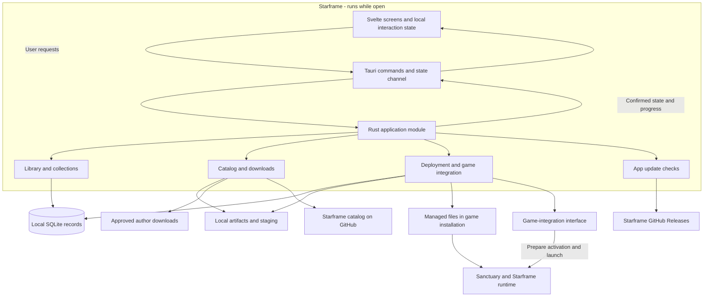
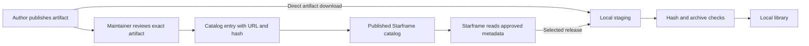
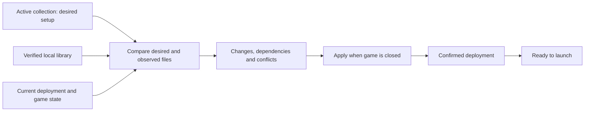
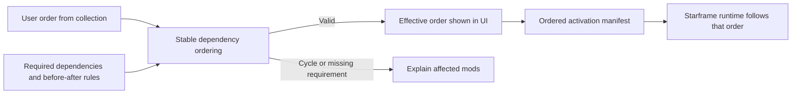
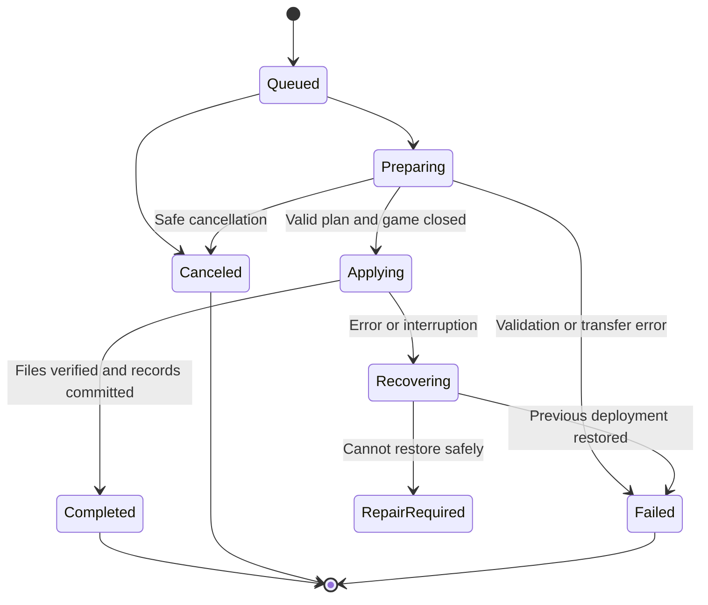
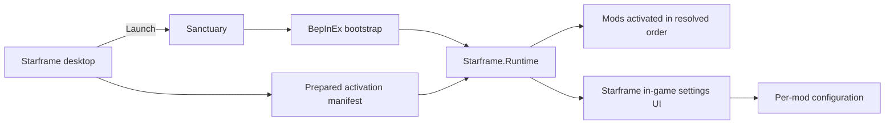
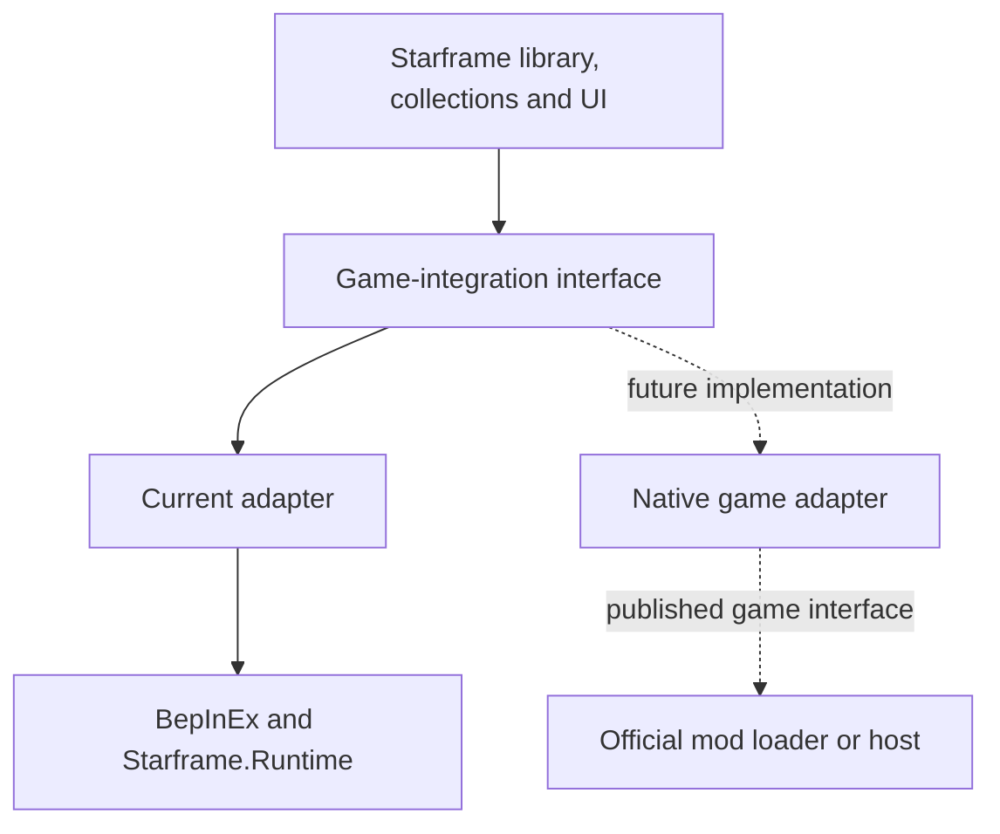

# Starframe architecture

Status: draft 0.4, revised on 6 September 2026. Accepted behavior is identified below; unimplemented structures remain proposals. Milestone 0.1.0 is complete. Milestone 0.1.1 is complete. Its binary uses bundled SQLite with retained-source conversion; see [implementation and recovery](docs/verification/sqlite.md). Its implemented state layer is described below; later modules remain subject to their milestone and prerequisites.

Read [DESIGN.md](DESIGN.md) for the accepted user experience and [CONTEXT.md](CONTEXT.md) for terminology. [DEVELOPMENT.md](DEVELOPMENT.md) defines continuous checks and versioning; [ROADMAP.md](ROADMAP.md) assigns the work to version milestones and issues. The [README](README.md) introduces the project, and [LICENSE](LICENSE) contains its licensing terms. Diagrams below are part of this proposal.

[Open the visual overview](docs/architecture-overview.svg) for a single-page map. The diagrams in each section show the detailed flows.

The [0.0.1 implementation handoff](docs/HANDOFF.md) narrows the initial Windows target, performance checks, activation/report formats, capabilities and settings registration. It records what can be implemented next and what still requires runtime evidence.

## 1. Starting point

The desktop foundation currently uses `src-tauri/src/app.rs` for in-memory diagnostic operations, `commands.rs` for four focused commands, and `model.rs` for serializable state and errors. A contract test generates the TypeScript types in `src/lib/generated/model.ts`. One replaceable Tauri channel sends the initial snapshot under the state lock, then revisions and a two-second heartbeat. Session IDs identify the native process; revision strings preserve the full Rust integer range. The frontend rejects older revisions and retired subscriptions. A silent connection is replaced after six seconds without an accepted snapshot. Search, selection, page scroll and draft notes stay in Svelte.

Diagnostics run bounded memory hashing outside the state lock in a blocking worker. Three simulated transfers report progress at most ten times per second. Request UUIDs prevent duplicate starts; cancellation becomes final only when the worker reaches its next boundary. This code has no storage or game operations. The single-instance plugin focuses the existing window before a second state owner can start. Closing the visible window ends the process. The local main-window capability grants only state subscription, diagnostic start/cancel and fixed external-page commands. External pages open through Rust's opener plugin; the frontend has no general opener permission. See [verification and limits](docs/verification/desktop-state.md).

Starframe has an installed desktop manager and a game-side runtime that we own. Svelte presents the user's setup; Rust owns saved manager state, downloads, and deployment. A C# runtime inside the game handles ordered mod activation and the in-game settings UI, with BepInEx providing the initial bootstrap. The game runs independently of the desktop manager.

The user has selected Tauri, Svelte, TypeScript, and Rust for the desktop app; Windows first; curated individual releases; managed local imports; ordered collections; game launching; and GitHub distribution. Starframe must own its in-game loader/settings experience, support load order, automatically apply edits when the game is closed, and allow users to try mods after a game update with a warning. Collections contain mod references and order, without mod settings. The catalog updates independently of the app.

The user reports that the game developers plan native mod loading/hosting. Design an explicit game-integration seam for that transition; do not assume an unpublished native interface exists. Bundled SQLite is selected for 0.1.1; see the [transition decision](docs/planning/sqlite-transition.md). Tauri's NSIS installer, uninstaller, and updater cover the desktop distribution requirements. These tooling recommendations still need implementation validation.

| Proposed choice | Reason |
| --- | --- |
| One Svelte frontend, one Rust crate, and a C# runtime project | Keeps desktop work and game integration in one repository, without a hosted backend. |
| Plain Svelte with Vite | The app needs bundled screens; it does not need server rendering. |
| Rust owns saved state and file changes | All views use the same confirmed state and the same validation rules. |
| A local library outside game loader folders | Disabled mods can remain installed without being visible to a loader. |
| Bundled SQLite for records; ordinary files for artifacts | Keeps local records in one embedded engine; archives and extracted content remain files. The 0.1.1 build uses bundled SQLite. |
| Downloads can overlap; game-file changes have one writer | Users can keep working without competing operations changing the same installation. |
| A portable collection file | Sharing can work without user accounts, cloud storage, or a Starframe server. |

## 2. Overall structure



The modules inside the desktop app are ordinary Rust/Svelte code. The C# runtime runs inside Sanctuary, not in a desktop background service. Tauri and the system webview manage their own process model. The installed desktop app needs no localhost HTTP server, daemon, or Node.js sidecar. The development server exists only during frontend development. [Tauri with Vite](https://v2.tauri.app/start/frontend/vite/)

### Proposed repository layout

Create files when the relevant work starts. This tree describes intended homes for code, not a scaffold to generate now.

```text
Starframe/
├── README.md
├── DESIGN.md
├── ARCHITECTURE.md
├── CONTEXT.md
├── LICENSE
├── catalog/
│   └── releases.json            Curated release metadata, no mod binaries
├── src/
│   ├── App.svelte               Window composition and navigation
│   ├── lib/
│   │   ├── native.ts            Typed calls into Rust; one state subscription
│   │   ├── state.svelte.ts      Confirmed snapshot and pending UI intent
│   │   ├── generated/           Rust-derived TypeScript data types
│   │   └── ui/                  Reused controls with accessible behavior
│   ├── features/
│   │   ├── mods/                My mods, mod details, local imports
│   │   ├── catalog/             Approved releases and install review
│   │   ├── collections/         Collection editing and import review
│   │   ├── downloads/           Operation progress and errors
│   │   └── settings/            Game setup, app updates, help and logs
│   └── styles/                  Design tokens and shared styles
├── src-tauri/
│   ├── src/
│   │   ├── lib.rs               Startup and Tauri wiring
│   │   ├── commands.rs          Validated desktop command entry points
│   │   ├── app.rs               Application state and operation coordination
│   │   ├── model.rs             Domain values and interface data types
│   │   ├── library.rs           Installed versions and collection edits
│   │   ├── catalog.rs           Catalog validation and release resolution
│   │   ├── packages.rs          Download, verification, extraction and import
│   │   ├── deployment.rs        Plan, apply, ownership and recovery
│   │   ├── ordering.rs          Dependency constraints and stable load order
│   │   ├── game.rs              Discovery, build identity, launch and observation
│   │   ├── integration.rs       Capability contract and current runtime adapter
│   │   ├── storage.rs           Local SQL queries and schema migrations
│   │   └── updates.rs           In-app release checks and update handoff
│   ├── migrations/             Ordered database migrations
│   ├── capabilities/           Tauri permissions for the app window
│   ├── tests/                  File-operation and recovery tests
│   ├── Cargo.toml
│   ├── Cargo.lock
│   └── tauri.conf.json
├── runtime/
│   ├── Starframe.Runtime/       C# BepInEx entry point, loading and settings UI
│   ├── Starframe.ModApi/        Small mod lifecycle/settings contract, if needed
│   └── tests/                  Activation, settings and content-order checks
├── contracts/                  Versioned activation/settings formats and fixtures
├── package.json
├── package-lock.json
└── .github/workflows/          Checks and release packaging
```

Keep feature-specific Svelte components next to their feature. Move a control to `lib/ui` when it has real reuse. Do not create a generic repository layer, dependency-injection framework, or adapter interface for every Rust file. The game-integration seam has an explicit future replacement requirement; the mod interface has real mod authors as callers. Keep both narrow. A module need not be a class or trait.

## 3. Module responsibilities

| Module | Small interface, expressed as intent | Behavior it owns |
| --- | --- | --- |
| Application | Start operation, cancel operation, subscribe to state | Work scheduling, current state, progress and shutdown coordination. It delegates domain work. |
| Library | Install into library, edit collection, remove stored version | Stable identities, collection references, requested setup and validation of edits. |
| Catalog | Read approved catalog, resolve release | Source metadata, compatibility evidence, dependency references, catalog freshness and withdrawn releases. |
| Packages | Prepare approved artifact, prepare local import | HTTP transfer, integrity checks, archive validation and immutable local content. |
| Deployment | Plan setup, apply plan, recover interruption | Safe file changes, ownership, backups, conflicts and the confirmed deployed setup. |
| Ordering | Resolve dependencies and requested priority | A deterministic effective load order, explanations for adjustments, and actionable dependency errors. |
| Game | Inspect installation, inspect runtime, launch | Executable/build identity, Steam discovery and running-game detection. |
| Integration | Inspect capabilities, plan activation, inspect activation result | Translation from Starframe's ordered setup to the current runtime or future native game facilities. |
| In-game runtime | Activate prepared setup, show and save mod settings | Game-side mod lifecycle, supported content overlays, actual activation order, and a Starframe-owned UI. |
| Storage | Load records, commit a named change | Embedded database access, record constraints, migrations and consistent persistence. Other modules do not issue ad hoc SQL. |
| Updates | Check release, begin user-requested update | Official app releases, notices, due times and the maintained updater integration. |

The useful test seams are package preparation and deployment: callers supply an approved plan and receive a result. Tests can use a temporary game directory, fixture downloads, and injected process/clock observations. Keep those substitutions narrow; do not mirror the entire production system with mocks.

### Frontend composition

```text
App
├── Sidebar
├── Workspace
│   ├── MyMods / Catalog / Collections / Downloads / Settings
│   └── ModDetails when selected
├── LaunchBar
├── UpdateNotice
└── DialogHost
```

Screens read shared confirmed state and derive their visible rows, counts, and readiness. They retain their own search, selection, scroll position, and editing drafts. Selecting a row must not require a Rust call. One row action must not remount the whole workspace. Use keyed lists, Svelte reactivity, CSS transitions, and the timings in DESIGN.md. Built-in Svelte state is enough for the first version; no additional state-management library is proposed. [Svelte state guidance](https://svelte.dev/docs/svelte/stores)

## 4. Rust and the interface stay in sync

Use Tauri commands for requests and a Tauri channel for confirmed state. Commands such as `install_release(release_id)`, `set_enabled(collection_id, mod_id, enabled)`, and `launch_game()` describe outcomes. Avoid exposing general-purpose commands such as `write_file(path, bytes)` or `run_shell(command)` to the webview. Rust validates IDs, current state, and permitted paths. Tauri supports async commands and channels for Rust/frontend communication. [Commands](https://v2.tauri.app/develop/calling-rust/), [channels](https://v2.tauri.app/develop/calling-frontend/)

The proposed `watch_state(channel)` interface registers a subscriber and sends an initial snapshot followed by newer snapshots in order. Registration and capturing the initial revision must share the same short synchronization step, so a change cannot disappear between initial loading and subscription.

A snapshot contains a session identifier, revision, library/collection summaries, game readiness, active operations, and update notice. It excludes artifact bytes, full logs, and large descriptions. Load those details through focused read commands when opened, and invalidate visible details when their record changes. Each replacement subscription supersedes the previous one. The frontend rejects old-session or older-revision messages and automatically reconnects after a broken channel. Complete snapshots let it recover without replaying every progress event.

Start with complete compact snapshots on meaningful changes. Coalesce transfer progress to at most ten updates per second across active work; preserve terminal outcomes in the operation records. If profiling shows that snapshot size affects responsiveness, split by domain revision. Do not introduce patch merging or an event-replay system before that need exists.

```mermaid
sequenceDiagram
    actor User
    participant UI as Svelte
    participant App as Rust application
    participant Worker as Package worker
    participant Disk as Library and records
    User->>UI: Install approved release
    UI->>UI: Show pending action immediately
    UI->>App: install_release with request ID
    App-->>UI: Accepted with operation ID
    App->>Worker: Prepare artifact asynchronously
    loop While transfer runs
        Worker-->>App: Progress
        App-->>UI: Updated state snapshot
        User->>UI: Browse another collection
    end
    Worker->>Disk: Verify content and save library entry
    Disk-->>App: Commit confirmed
    App-->>UI: Installed in library; deployment state separate
```

An accepted command is not a completed operation. Persisted changes become confirmed only after their commit. Rust assigns operation IDs and recognizes repeated request IDs during the session so a retry does not start a second install. A duplicate pending action reuses its existing operation. After restart, recovery examines saved operation records instead of blindly repeating the request.

For rapid toggles, the frontend shows the latest intent immediately and sends at most one edit per collection at a time, coalescing later edits. Each edit includes the collection revision it was based on. Rust rejects a stale edit with the current revision. The UI preserves the user's draft and reconciles it; it does not silently overwrite a newer edit from an import or another action.

Use async I/O for transfers and bounded background workers for SQLite, extraction, hashing and other synchronous work. Keep the existing single database owner and request queue. Never hold a shared-state lock through network or file work. Simply marking a function async does not make expensive synchronous work nonblocking. Cancellation of blocking work must be cooperative; aborting its async handle cannot stop a blocking task that has already started. [Tokio blocking-task behavior](https://docs.rs/tokio/latest/tokio/task/fn.spawn_blocking.html)

## 5. Saved data and file ownership

The 0.1.1 build uses bundled SQLite through pinned rusqlite 0.40.2 with default features disabled and bundled plus backup. One desktop worker owns the connection; synchronous SQL must not run on the UI thread. No database account, service, replication or cloud synchronization is required. See the [decision, dependency evidence and conversion plan](docs/planning/sqlite-transition.md).

The historical 0.1.0 implementation from issue #9 used pinned Turso 0.7.2 with defaults disabled. Its required Windows checks passed. The SQLite decision is based on the accepted workload and dependency reduction, not a failed Turso gate. SQL and ordered migrations live in src-tauri/src/storage.rs. Schema 1 stores library entries, collections, ordered references and a database revision; schema 2 adds active selection; schema 3 adds the selected game installation. References retain exact content independently of local availability. Artifact paths derive from validated lowercase SHA-256 values; binaries remain outside SQL.

The storage module owns one connection and an OS file lock. Short immediate transactions validate expected revisions; failed edits roll back. The app opens storage after creating the shell and publishes ready/error status through the existing channel. Database revisions cross that channel as decimal strings. Library and collection editing commands remain later work.

SQLite uses WAL, foreign keys, synchronous=FULL, immediate transactions and a 250 ms busy timeout. Backups use SQLite's backup API, sync the completed database and write a completion marker. Schema changes and version updates commit together. Startup validates ownership, engine, version, integrity and logical records. Invalid data produces a visible error without resetting the library.

The first 0.1.1 startup copies legacy state.db and its WAL into a unique staging directory under the locked app-data root. SQLite reads only that copy. The converter rebuilds schema 4 with engine='sqlite', preserving all logical records and revisions. After validation, close/reopen equality checks and file flushes, it marks the candidate complete and renames its directory to sqlite/. Original Turso files, legacy backups and artifact files remain in place. Startup uses an existing sqlite/ directory exclusively; incomplete or invalid contents cause an error rather than a fallback to stale legacy records. Interrupted staging directories are retained, and retry uses a new directory. See [recovery and verification](docs/verification/sqlite.md).

The workload through 0.7.0 needs ordinary local queries, constraints and short transactions. The game runtime reads prepared manifests without opening the database. Catalog refresh and collection sharing do not require database sync. The [transition decision](docs/planning/sqlite-transition.md) records the choice; original [Turso checks](docs/verification/storage.md) remain historical evidence.

Use the operating system's per-user app-data directory resolved through Tauri. The installation root selected by the user is separate. Do not hardcode the developer's Steam path or put user data beside the Starframe executable.

```text
Starframe app data/
├── state.db                    Local records (SQLite after 0.1.1)
├── artifacts/<sha256>/         Verified archives and extracted immutable content
├── staging/<operation-id>/     Incomplete downloads and validation work
└── logs/                      Bounded diagnostic logs

Game installation/
├── engine/
│   ├── BepInEx/plugins/Starframe/  Bootstrap plugin for our runtime
│   └── Starframe/                 Ordered activation manifest, active mods, config
└── .starframe/                Proposed staging and backups outside loader scans
```

Confirm that `.starframe` is outside all relevant game/loader scans before adopting that path. Place temporary deployment files on the target volume where possible. Copy from the library rather than hardlinking it: a loader or developer changing a deployed file must not change the preserved source copy.

| Record | Minimum information |
| --- | --- |
| Game installation | Local ID, validated root, executable identity, detected build, loader state. |
| Mod | Stable ID, display name, author and origin. |
| Release/artifact | Release ID, mod ID, version label, source URL, expected hash, layout, dependencies, ordering constraints and compatibility evidence. |
| Library entry | Available release or local-build identity, content hash, prepared content location. |
| Collection/entry | Name, revision, ordered mod references and exact release/build identity. Membership means enabled. No mod settings. |
| Deployment/file | Installation, integration mode, runtime/format version, applied collection revision, effective order, owned relative path, owner, content hash and backup reference. |
| Operation | Request/operation IDs, kind, affected records, durable phase, result and recovery details. |

Local records identify exact content, so a shared collection can reuse the same artifact or fetch it when missing. A version label alone is insufficient because an author can replace a download or a developer can rebuild without changing that label. Hashes on local imports identify content and detect changes; they do not trigger online release checks.

Keep database schema versions separate from catalog and collection-file format versions. Back up records before migrations, reject unsupported newer formats, and never silently replace a corrupt database with an empty library. Preserve user data and provide a repair path. Logs are diagnostic; the recovery record carries the information needed to repair an interrupted operation.

The initial managed runtime and process-bound reports are implemented in #13. [Activation verification](docs/verification/runtime-activation.md) distinguishes verified managed fixtures from unsupported content and conventional plugin activation. The core targets .NET Standard 2.0 for complete Mono dependency packaging; the Unity bootstrap targets 2.1 against installed references.

## 6. Catalog and downloads

Keep `catalog/releases.json` in the Starframe repository and publish it independently of desktop releases. Issue #16 implements the initial empty metadata file and fixes the client endpoint at `https://raw.githubusercontent.com/Mastervoliumpl/Starframe/main/catalog/releases.json`; publication awaits merge to main. [Catalog schema and publication](catalog/README.md) define validation, retained identities, HTTP limits and the SQLite cache. A maintainer's catalog commit becomes available at that endpoint without rebuilding or updating the app. GitHub/CDN cache timing can delay visibility; the app must not claim instant global propagation.

Each approved artifact records a stable release ID, exact URL, SHA-256, expected archive layout, dependencies, ordering metadata, and tested game builds. Separate `schemaVersion`, which controls how to read the file, from `catalogRevision`, which changes when entries change. Adding releases within a supported schema needs no app update. Display author versions as labels; do not assume every author uses semantic versioning.



Catalog changes go through a reviewable Git commit. Automated checks validate IDs, schema, supported layouts, dependency references and cycles; they do not claim to perform a malware review. A changed artifact requires new review and metadata, even when its URL or version label stays the same.

The installed app trusts a fixed maintainer-controlled HTTPS catalog location and validates its contents. Expected artifact hashes detect unexpected download changes; they do not prove that approved code is benign or protect against a compromised catalog publisher. Imported collections cannot add trusted download sources. Invalid catalog data leaves the last valid cache in use with a visible status.

Use one async HTTP client with timeouts, bounded transfers, and bounded retries. Permit expected download-host redirects, but reject HTTPS downgrades and unexpected local/private destinations; enforce that policy on every redirect. No embedded GitHub token is needed for public downloads. Follow server retry instructions and use conditional requests where supported. [reqwest](https://docs.rs/reqwest/latest/reqwest/), [GitHub request guidance](https://docs.github.com/en/rest/using-the-rest-api/best-practices-for-using-the-rest-api)

Fetch the catalog on launch and every five minutes while the desktop app is open, separately from app-update checks. Use the HTTP validator where available, then validate a changed catalog and replace the cached revision in one record transaction. Publish the resulting state to the UI immediately. The user does not press Refresh, restart, or install a new app version. Offline mode keeps the last valid revision and its last-check time.

A newly approved mod release appears live, but never silently replaces versions pinned in a collection. A withdrawn release is marked and blocks new downloads; keep its stable identity so old collections still explain what they reference. Do not delete or renumber release IDs. Mirrors may change only if they provide the same approved bytes and hash. Authors can still remove artifacts, so permanent download availability cannot be guaranteed. Invalid or unsupported catalog schemas retain the last valid cache and show the specific problem.

### Game-version warnings

When a detected game build changes, recalculate the displayed compatibility evidence for each catalog mod. If the last supported build is older, show `Made for a previous game version` with that build and the current build in details. If no useful evidence exists, show `Not checked for this game version`. A lack of testing is not proof that a mod is broken.

These warnings do not disable a mod, remove it from the collection, or prevent trying a launch. The launch area can summarize warnings with a route to details while keeping launch available. Missing executable files, an unusable loader, missing required dependencies, invalid activation contracts, or an incomplete deployment are separate actionable failures. Do not disguise a game-version mismatch as a hard dependency failure to bypass the warning policy.

Local imports skip catalog release and compatibility-version checks. They still participate in dependency, load-order and structural validation. Preserve any author version label as metadata without turning it into an online update check.

### Package preparation

Extract into private staging, never directly into the game folder. Reject absolute paths, parent traversal, link entries, Windows device/alternate-stream paths, case-insensitive target collisions, and archives exceeding configured file-count or expanded-size limits. Check the final destination and reparse points as well as archive strings. Never run archive-supplied scripts or load a DLL into Starframe to inspect it.

Initial support covers reviewed ZIP layouts and explicit local DLL/folder imports using supported activation contracts. Starframe-managed mods, conventional BepInEx plugins, content overlays, and bootstrap packages have different capabilities. An arbitrary DLL is not automatically compatible with Starframe's lifecycle. Unknown layouts receive an actionable unsupported result rather than a guessed destination. Required downloaded dependencies resolve to approved exact releases; a matching explicitly imported local dependency can satisfy a compatible requirement without becoming a catalog release.

## 7. Deploying a collection safely

The library is what the user has locally. A collection is what the user wants enabled. The deployment records what is actually prepared for the game. Keep all three separate.



Edits save the requested collection immediately. Apply a valid setup automatically when the game is closed; there is no separate Apply button. While it runs, show `Pending for next launch` and keep the current deployment intact. When it closes, apply the latest requested revision automatically. Routine edits need no confirmation. Unresolved dependencies or unsafe file conflicts explain what the user needs to resolve.

Exit-time application requires the desktop app to remain open. If the user closes Starframe first, retain the pending revision and apply it on the next app start once the game is closed. No background process waits on the user's behalf.

Enabling a mod adds it to the active collection; disabling removes it from that collection while retaining its files in the library. A collection does not need a second hidden list of disabled entries. The UI can show all library mods with switches derived from membership.

### Load order

Support automatic resolution and manual ordering. A collection stores the user's requested sequence; deployment records the effective sequence that the runtime will use. Show both when constraints require an adjustment. Manual ordering must have keyboard move-up/down controls as well as drag-and-drop.

The ordering module builds a directed graph: required dependencies load before their dependents, and mandatory author/curator `before`/`after` rules become additional edges. Among valid next choices, prefer the user's order, then stable mod ID as a final tie-breaker. This produces the same effective order for the same inputs. Use an existing suitable graph routine where it fits; otherwise a small stable topological traversal with standard collections is sufficient. Do not build a general version solver.

For example, if Terrain Tools requires Core Library, moving Terrain Tools above it keeps Core Library first and explains that dependency. A hard cycle lists the mods and constraints involved; an arbitrary alphabetical fallback must not pretend to resolve it. Optional suggestions remain warnings, so the user can choose another order when it is valid.



Order has a defined scope. Starframe lifecycle callbacks run sequentially in effective order. For supported content overlays, propose that later entries override earlier entries at the same logical content path; show those conflicts and winners before launch. DLL initialization order cannot guarantee the order of every later event handler or patch supplied by third-party libraries. Conventional BepInEx plugins that activate before our runtime cannot be given an arbitrary Starframe order without additional integration. Label that limitation instead of offering a drag handle that has no effect. Prioritize packages whose activation order Starframe can actually enforce.

### Applying and recovering changes

Downloads and package preparation can overlap, with an initial limit of three transfers. A single writer applies changes to the selected game installation. Both the transfer limit and single-installation scope are draft simplifications. Library browsing, collection editing, and other independent work remain available.

1. Build a plan from a fixed collection revision and current observations. Include expected file hashes, resolved load order, integration capabilities, space requirements, and game-build identity. Keep compatibility warnings separate from hard preparation failures.
2. Prepare content and rollback copies before touching active files. Acquire exclusive Starframe deployment ownership and recheck the game process, paths, collection revision, and plan assumptions. Reject unknown file ownership or unexpected changes. Rebuild a stale plan before applying it.
3. Persist a recovery record before the first mutation. Record each intended file change and the location of its previous content. Move or replace only paths covered by the validated plan.
4. Verify the resulting files, then commit the applied deployment record. Clear recovery data only after the new state is confirmed.
5. On failure, restore the previous known state where safe. If restoration fails or ownership is unclear, preserve evidence and backups, mark `Repair required`, and disable launch through Starframe until resolved.

A database transaction does not make multiple filesystem writes atomic. Recovery must handle a crash between any two steps, including files changed before the database commit. At the next start, compare actual hashes with the recovery record and complete or roll back a known operation. If the game is already running, postpone recovery writes until it closes.



Once Applying starts, cancellation means reaching a safe completed or rolled-back state; it cannot mean killing a worker mid-write. Close requests stop new work and background checks, cancel safe transfers, and explain any short safe-exit wait in the visible window. Do not hide an unfinished operation in a tray process.

Preserve user settings on mod updates and, by default, on uninstall. Offer a separate explicit settings-removal choice after its policy is agreed. Keep shared loader files owned by their loader package, not by every dependent mod. Deleting a collection does not uninstall its mods; uninstalling a needed version identifies affected collections before proceeding. Mods discovered already in the game directory are observed external files until the user explicitly adopts or imports them. Their presence does not grant Starframe permission to overwrite them.

### Starframe-owned in-game runtime

BepInEx provides the established game bootstrap. Our `Starframe.Runtime` plugin owns the mod-loading policy, activation reporting, and in-game settings UI. Propose C# because the inspected game uses Unity/Mono and BepInEx plugins use its managed plugin model. Target the framework and BepInEx release verified against the game; do not assume the newest .NET runtime can run inside it. [BepInEx plugin model](https://docs.bepinex.dev/articles/dev_guide/plugin_tutorial/2_plugin_start.html)



The initial adapter deploys only the bootstrap plugin under `engine/BepInEx/plugins/Starframe`. Managed payloads and a versioned activation manifest live under a separate `engine/Starframe` location. The runtime reads that manifest and activates only listed entries in the supplied order, rather than recursively loading every DLL it finds. Disabled content remains outside active scan paths. Shared dependency assemblies may load as required, but an unlisted mod's entry point must not execute.

Define a small lifecycle contract for mods we can load ourselves: stable identity, declared dependencies, entry point, initialization, supported shutdown behavior, and optional settings registration. Reuse BepInEx facilities for logging and configuration where they fit; do not rewrite its injection/bootstrap layer. Existing plugin formats need an explicitly tested compatibility path, not an assumption that instantiating any plugin class reproduces its expected loader behavior. The exact author-facing contract and its licensing need a separate review before mods depend on it.

Keep the runtime's responsibilities narrow: validate manifest/contract versions, activate in order, apply supported Lua/data overlays without rewriting shipped game assets, present settings, and write a bounded activation report. The overlay implementation depends on the actual game's content-loading interfaces and needs investigation. On a mod activation failure, mark that mod and its required dependents as failed/skipped, explain the failure in-game, and do not claim that the requested setup loaded successfully. Retrying or removing a loaded DLL is not equivalent to unloading its assembly or undoing its side effects.

The runtime performs no catalog downloads or app-update checks and does not open the desktop database. It can run when the desktop app is closed because it is part of the running game. It exits with the game. This is distinct from a hidden desktop process or installed service.

Use a versioned JSON activation document as the initial desktop/runtime handoff. It records deployment revision, selected runtime contract, ordered mod IDs, content hashes, and validated relative paths. Include a metadata-only installed-mod inventory for the in-game list; only ordered activation entries authorize loading. Disabled mods need no deployed executable payload or assembly reflection to supply their names. Rust prepares the document with the deployment; C# reads it at startup. Runtime reports include that revision and a game-session ID, so the desktop never treats an old success report as evidence for a new launch. Keep wire-format fixtures under `contracts` and test them in both languages. No socket server is needed for this initial handoff.

### Mod settings have one owner

The 0.2.0 implementation registers typed settings through `IModContext.Settings` in the reference-free core. The bootstrap adapts them to per-mod BepInEx files and the game-native menu. [Settings verification](docs/verification/runtime-settings.md) records supported types, atomic save behavior, effective versus saved values, the completed keyboard smoke check, and the final milestone display-scaling matrix.

Mod settings are values such as key bindings, UI scale, or feature options. They are not collection membership, load order, or copies of the whole game configuration.

Starframe adds a `Mods` entry to the game's main menu and owns its installed/enabled mod list and settings behavior. Reuse Sanctuary's menu components, styling, navigation and transitions where supported. Inspect the game's UI hooks before choosing the C# presentation implementation; the earlier browser overlay is superseded. Use Starframe's monochrome mark in the main-menu entry, tinted and sized like adjacent game icons. This remains our runtime; it does not depend on another community manager.

The game-native Mods menu edits each mod's configuration through the runtime. Reuse BepInEx `ConfigFile`/`ConfigEntry` where suitable for types, defaults, descriptions and persistence. Stable keys identify settings independently of their display labels. Show enabled membership separately from actual activation outcomes. Disabled mods without registered settings explain that enabling and restarting is required. [BepInEx configuration](https://docs.bepinex.dev/articles/dev_guide/plugin_tutorial/4_configuration.html)

Initially, the runtime is the only writer while the game is running. The desktop can show reported values or a path, but it does not independently write those same settings files. In-game changes save directly to the mod's configuration; there is no collection copy to adopt or merge. Apply a setting live only if its mod declares that behavior safe; otherwise show that it takes effect after restart. Preserve configurations when collections change.

A full desktop settings editor is not required for the first version. If added later, it can write through a defined settings interface when the game is closed; editing during play would need a single authoritative runtime writer. Do not add that communication system just to satisfy a hypothetical merge workflow.

### Future native game support

Keep the desktop library, collection format, ordering UI, and catalog independent of BepInEx paths and runtime-specific plugin IDs. The game-integration interface accepts an ordered setup and returns supported capabilities, activation preparation, readiness details, and observed results. The current adapter implements this with Starframe.Runtime. A future native adapter will use the game's published mod facilities.



This is a required seam, not permission to implement a speculative native adapter today. Capabilities should describe whether manual order, content overlays, settings access and activation reports are supported. Do not show controls that the selected adapter cannot honor. Where the native loader resolves dependencies itself, use its supported result rather than running a competing loader.

When native support ships, verify it, map native mod IDs to stable Starframe identities, and offer a migration preview. Keep the old setup recoverable until the native path is verified. Remove only Starframe-owned bootstrap files that are no longer needed; do not delete another tool's BepInEx installation. Avoid activating the same mod through two loaders. Collection names, references, and order should survive even if some mods require a native-compatible release. Actual native conversion rules remain unknown until the developers publish their interface.

### Discovery and launch

Issue #15 connects the existing desktop game worker to journaled runtime preparation, revision-checked executable launch and process-bound report observation. [Implementation and limits](docs/verification/game-launch.md) distinguish empty-collection support, missing build resources, external launches and the game shutdown smoke-check limitation.

Game discovery reads Steam library/install metadata, validates the executable and layout, and falls back to a native folder picker. Keep app IDs and release/playtest differences in game metadata. Earlier local inspection found a Unity/Mono x64 playtest installation, app 4511930, build 25135612; this is dated evidence, not a universal path or a runtime compatibility claim. Reverify supported game layouts before implementation.

Issue #10 implements read-only discovery in `game.rs` with Windows registry/process calls in `windows_game.rs`. The installed playtest layout was reverified on 6 September 2026. `game_service.rs` owns the storage connection and a bounded request queue, publishes game state, observes processes every two seconds and revalidates only the selected installation every 30 seconds. Steam library discovery runs at startup or on request. Long observation gaps invalidate running-state evidence before a fresh check. Schema 3 persists one selected installation ID/path. Native selection is confirmed only after validation and the database commit; failed/cancelled selections retain the previous record. See [verification and limits](docs/verification/game-discovery.md).

Launch through the supported Steam/executable route after final readiness checks. If the requested collection changed during preparation, prepare that newer revision before launch. A successful launch request is not evidence that the game started or loaded every mod. Observe the actual game process, including launches outside Starframe; treat an unknown runtime state as a reason to postpone writes. Starframe cannot fully prevent Steam or another program from starting the game during a file change. Recheck before applying, stop safely on a detected start, and make this limitation part of the integration test plan.

## 8. Collections and local development

Use a collection name and an ordered list of mod references. Propose a versioned `.starframe-collection.json` file as the first sharing mechanism. Each reference identifies a stable mod ID, the same approved release/artifact hash, or local content identity where applicable. Technical format/version identifiers support reading the file; they are not extra collection settings. Membership means enabled, so a separate enabled flag is unnecessary. Do not include mod settings, binaries, credentials, absolute local paths, or arbitrary installation commands.

On import, first match each reference against verified content already in the library. Create the collection with its shared order and show any missing content as pending, then download only missing approved artifacts. The user accepts the import once; there is no need to click Install for every missing mod. Reuse files across collections instead of downloading separate copies. Show progress immediately, and apply the complete valid collection automatically when selected and the game is closed.

If a release has disappeared, is withdrawn from approval, has changed hash, or cannot satisfy required dependencies, mark the reference unresolved and explain the reason. Do not silently substitute latest. Keep the incoming list/order available so the user can explicitly repair it. A local-only reference can match the recipient's imported bytes, but cannot be downloaded without an approved source. An optional source link in a share file is informational; it cannot bypass the curated catalog. Share the file through any existing channel; no Starframe account or collection-hosting service is required.

Treat local imports like other library mods: enable, disable, order, add to collections, inspect, and uninstall. Their only source-specific omissions are catalog update/compatibility-version checks and automatic remote fetching. File hashes remain useful for change detection and collection matching; they are not version notifications. No separate developer-only manager is required.

For local development, keep a managed copy and a reference to its source folder. A watcher detects changes, waits for writes to settle, and prepares a new hashed copy outside the loader paths. An incomplete build retains the last valid copy and shows a pending/error state. Recheck the source before finalizing a copy so mixed build outputs do not become a confirmed revision.

When the game is closed, automatically apply a valid new build if it is in the active collection. When it runs, queue that application until the game closes. Do not promise DLL hot reload. Uninstall removes Starframe's managed copy and references, never the developer's source directory. Shared collections mark unmatched local builds as unresolved local requirements rather than embedding binaries or paths.

File notifications are hints, not the sole evidence of change. Reconcile watched locations on startup and resume, and use a limited fallback scan for missed notifications. Watch only imported sources, managed deployment locations, and relevant config files. Do not scan every Steam folder continuously. [notify behavior and limitations](https://docs.rs/notify/latest/notify/)

## 9. Windows distribution, app updates and lifetime

Check Starframe releases after the shell opens, then every five minutes while the app is open, including minimized. Run the timer in Rust so window visibility does not determine scheduling. Use one check at a time; after sleep, perform one overdue check rather than replaying missed intervals. Manual checks join an existing check instead of duplicating it.

Use Tauri's NSIS installer in current-user mode, its generated Windows uninstaller, and the maintained Tauri updater plugin. These cover the desktop distribution requirements; a second installer framework or custom updater is unnecessary. NSIS supports a per-user installation and WebView2 prerequisite handling. Test clean installs, upgrades and removal on the supported Windows versions, including a machine without WebView2. [Tauri Windows installer](https://v2.tauri.app/distribute/windows-installer/)

Publish signed update artifacts and matching static updater metadata through official GitHub releases. The public verification key ships with the app; the signing key stays in the release environment. Use version comparison and stable-channel metadata, not release timestamps. Tauri supports this installation/update path and requires update signatures. Validate the complete release flow before shipping. [Tauri updater](https://v2.tauri.app/plugin/updater/)

Show version, release notes, and a quiet persistent notice. A dismissed release stays discoverable without repeated prompts. Failed checks show an unknown check result rather than `Up to date`. Updating requires user action. Before invoking installation, finish or safely stop file operations and flush saved state. For the first version, wait for the game to close too: an app release can include a new in-game runtime or contract. Update the app, then prepare its compatible runtime through normal deployment on the next start. Never replace a running game's loaded runtime files or claim readiness while its contract is unsupported.

Catalog publication remains separate. A catalog-only edit changes the independently fetched JSON and its revision; it does not rebuild the installer, update the desktop app, or replace installed mod releases.

The Windows uninstaller removes app-owned installation files, shortcuts and registration. Preserve collections, imported files and saved mod settings by default. Removing game integration is a separate Starframe operation: restore backed-up originals and remove only files recorded as owned by Starframe, while the game is closed. Provide `Remove Starframe from game` in Settings. If exposed during uninstall, use Tauri's NSIS hooks to invoke that same cleanup operation before app removal, rather than implementing another installer. A failed requested cleanup must show its unresolved paths and allow retry or explicit app-only removal. Uninstalling Starframe must never recursively remove the game, another loader's files, or local mod source folders.

An explicitly requested installer may run to replace the app after its process exits; that is a finite installation step, not a persistent update checker. No service, scheduled task, autostart agent, or hidden tray mode is installed. Ordinary close cancels checks and exits Starframe. Closing Starframe leaves an already-running game alone.

## 10. Dependencies and security scope

The repository has no application dependencies yet. The following are candidates to validate when implementing the relevant behavior, not an instruction to install everything now.

| Need | Proposed reuse |
| --- | --- |
| UI and bundling | Svelte, TypeScript and Vite; plain CSS tokens and native HTML controls where suitable. |
| Desktop integration | Tauri commands/channels; maintained dialog, opener, single-instance and updater plugins only where needed. |
| Serialization and shared data types | Serde/serde_json; evaluate ts-rs to generate TypeScript data types from Rust. |
| Work scheduling | Tauri's existing async runtime and bounded Tokio blocking tasks. |
| HTTP and local records | planned reqwest and implemented bundled SQLite through rusqlite; no cloud sync feature. |
| Archives, content identity and version checks | Maintained ZIP, SHA-256 and semantic-version libraries; select narrow features and compatible versions. |
| File observation | notify, plus bounded reconciliation scans. |
| In-game bootstrap and settings persistence | BepInEx; C# runtime built for the verified Unity/Mono environment. Reuse its config types behind Starframe's own settings UI. |

Generating interface data types avoids manually maintaining the same shape in two languages. Keep Tauri command wrappers small and test their serialization, including enum tags, optional fields, errors, and numbers crossing JavaScript's safe-integer limit. Generated TypeScript declarations do not validate imported JSON at runtime. [ts-rs](https://docs.rs/ts-rs/latest/ts_rs/)

Use a single-instance guard so opening Starframe twice does not create two writers. The second launch focuses the existing window. Limit initial support to one selected game installation, while keeping installation identity in saved records. [Tauri single-instance plugin](https://v2.tauri.app/plugin/single-instance/)

The bundled webview gets only the commands and plugin permissions it needs. Never grant remote mod pages native permissions or load them inside the privileged app window. Open external pages in the user's browser, restrict URL schemes, treat descriptions as untrusted text, and avoid raw HTML. Validate every command argument in Rust; Tauri capabilities do not replace those checks. [Tauri capabilities](https://v2.tauri.app/security/capabilities/)

Run as a normal user. If the game location cannot be written, explain the problem instead of routinely elevating the whole app. Resolve permission handling before release. Logs must omit credentials and avoid exporting local paths without review. Mods run in the game and are not sandboxed by Starframe; checking an archive does not isolate the code it contains.

## 11. Verification and delivery

No runtime claims are verified by this document. Add tests alongside features and reproducible bug fixes, then verify integration at each milestone's exit. Follow DEVELOPMENT.md for required language checks and CI; do not defer the test suite until the release milestone. Prioritize tests that cross the module interface and exercise actual temporary files:

| Scenario | Required result |
| --- | --- |
| Slow download/extraction | Navigation and edits remain responsive; input feedback meets the design target under stated hardware/load. |
| Rapid toggles and delayed replies | The last requested state survives; older results cannot overwrite it or duplicate work. |
| Broken state subscription | Reconnection restores current state without resetting navigation or losing edits. |
| Malformed archive or changed download | Nothing reaches the game folder; an actionable error remains on the operation. |
| Failure after each deployment step | Restart restores or identifies the incomplete state; no false readiness. |
| Unknown or externally edited file | No silent overwrite/deletion; the user sees the conflict. |
| Game running or runtime detection uncertain | Game-file changes wait; library work and collection drafts remain usable. |
| Rebuilt local mod | A stable new copy becomes available live; source files are never deleted. |
| Shared collection with unavailable release | Import review identifies the gap and never substitutes a release silently. |
| Sleep, offline mode, repeated checks and close | One due check, useful cached state, server backoff, and no checker after exit. |
| Database migration and interrupted update | Existing data survives or a clear recovery path is provided. |
| SQLite transaction, process termination and legacy conversion | The pinned Windows build preserves committed records; recovery and backup/restore work with the features actually used. |
| Dependency order, manual priority and cycles | The result is deterministic; mandatory dependencies precede dependents; cycles identify the involved mods. The actual runtime follows the supported order. |
| Older game compatibility declaration | The UI warns and still allows enable/launch; genuine structural failures remain separate. Local imports make no catalog version-check requests. |
| Catalog changes while the app version stays fixed | A valid newer catalog appears live; invalid or failed responses leave the last valid catalog usable. Installed mods are not silently upgraded. |
| Shared collection with matching local content | Reuse verified bytes, download only missing approved releases, and preserve the ordered references without copying settings. |
| In-game settings and desktop close | The runtime remains usable with the desktop closed, saves configuration once, and reports restart requirements without a merge workflow. |
| Unsupported integration capability | The UI explains unavailable ordering/settings controls rather than presenting controls with no effect. |
| Windows install, update and uninstall | Signed updates work; app data is preserved by default; optional game cleanup touches only owned files and handles a running game or failure visibly. |

Use Rust tests for package/deployment behavior, frontend tests for meaningful interaction logic, and C# tests plus in-game checks for activation and settings. Run shared contract fixtures through both Rust and C# readers. Use a small Windows desktop integration suite for the Tauri connection, installer, file permissions and game launch. Browser-only UI tests cannot establish native integration behavior. Accessibility, reduced motion, Windows scaling, keyboard focus, and full-path visibility follow DESIGN.md.

Use GitHub Actions for frontend checks, Rust formatting/lint/tests, C# build/tests, cross-language contract fixtures, catalog validation, and Windows packaging as each source project arrives. Documentation checks start during planning. Pin dependency versions in lockfiles, keep action references immutable, and require relevant checks before merging. Publish an installer, matching source, and signed updater metadata through the official release workflow only after release authorization. The installer may include Starframe's own runtime; third-party mod binaries remain author-hosted downloads. Verify redistribution terms and integrity of bootstrap files and game reference assemblies before any packaging. Do not redistribute game assemblies merely because the runtime needs them to compile.

ROADMAP.md gives these slices their release targets. Work only within the active milestone and satisfy each issue's dependencies before starting it. Add modules when a slice needs them. Each completed slice gets a focused commit and relevant checks; version preparation and milestone exit verify the integrated result.

## 12. Review status and remaining work

| Area | Current direction | Remaining work |
| --- | --- | --- |
| Local persistence | Bundled SQLite with retained-source legacy conversion is implemented. | Retain migration/recovery tests as record schemas grow. |
| Collections and application | Name plus ordered references; reuse exact content; automatically apply when the game is closed. User confirmed. | Validate import recovery, dependency adjustments and pending-state UI. |
| Load order | Resolve dependencies automatically; allow manual priority within valid orders. | Review the UI; verify actual activation and define supported content-overlay precedence. |
| Local builds | Normal mod controls without catalog version checks; watched managed copies. | Test incomplete builds, missed notifications and exit-time application. |
| In-game scope | Starframe owns activation and settings UI; BepInEx provides bootstrap. User confirmed. | Verify the game integration, define the small mod contract, and review the in-game screen. Decide which existing BepInEx packages can be supported honestly. |
| Mod settings | Per-mod configuration; runtime writes during play; excluded from collections. | Define supported setting types, defaults and restart behavior. Review SDK licensing before publishing a mod API. |
| Future native support | Keep one replaceable integration interface. User requested. | Wait for the official API before designing its adapter and migration details. |
| Catalog and compatibility | Independent five-minute refresh; older game-version declarations warn without blocking. User confirmed. | Validate metadata publication, caching, withdrawal and offline behavior. |
| Windows distribution | Use Tauri NSIS, its uninstaller and signed updater. | Verify on supported Windows versions, including data retention and Starframe-owned game cleanup. |

The remaining work concerns interface details and verification. The user-confirmed behavior above is not reopened as a product question. Desktop state and database recovery now have recorded implementation evidence. Game integration and installer behavior remain unverified proposals.
