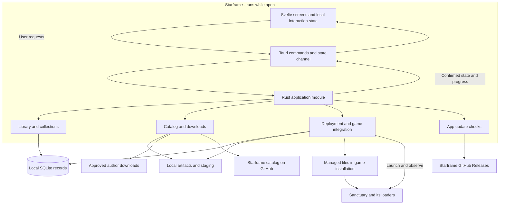
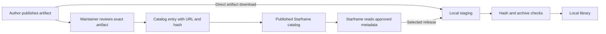
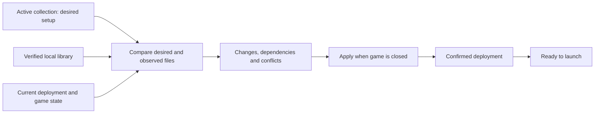
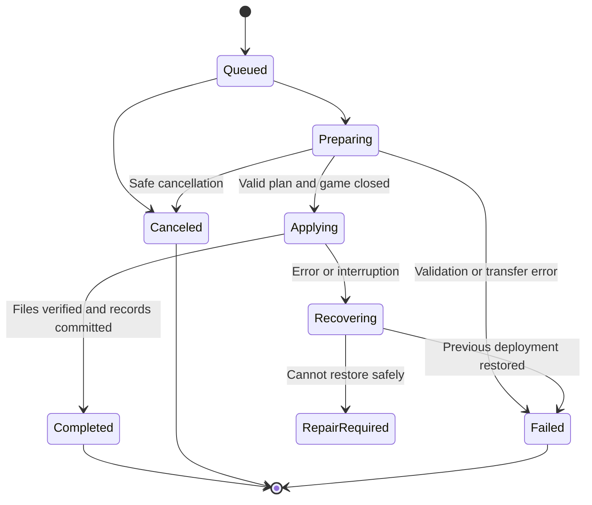
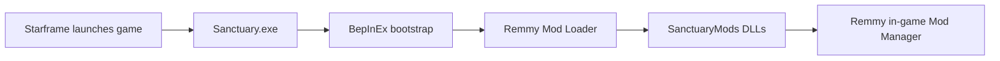

# Starframe architecture

Status: first draft for discussion, 6 September 2026. This document proposes structure and behavior; it does not authorize application implementation. The repository currently contains documentation and a license, with no application code or installed project dependencies.

Read [DESIGN.md](DESIGN.md) for the accepted user experience and [CONTEXT.md](CONTEXT.md) for terminology. The [README](README.md) introduces the project, and [LICENSE](LICENSE) contains its licensing terms. Diagrams below are part of this proposal.

[Open the visual overview](docs/architecture-overview.svg) for a single-page map. The diagrams in each section show the detailed flows.

## 1. Starting point

Starframe should be one installed desktop app with a local library of mods. Svelte presents the user's setup and responds to input. Rust owns persistent state, downloads, and changes to the game installation. The game and its loaders run separately from Starframe.

The user has selected Tauri, Svelte, TypeScript, and Rust; Windows first; curated individual releases; managed local imports; collections; game launching; and GitHub distribution. Live updates, responsive controls, and no work after the app closes are requirements. Other choices in this document are proposals, including SQLite, the module layout, collection pinning, and deployment rules.

| Proposed choice | Reason |
| --- | --- |
| One Svelte frontend and one Rust crate | Keeps related work in one repository without separate backend deployment or a crate workspace. |
| Plain Svelte with Vite | The app needs bundled screens; it does not need server rendering. |
| Rust owns saved state and file changes | All views use the same confirmed state and the same validation rules. |
| A local library outside game loader folders | Disabled mods can remain installed without being visible to a loader. |
| SQLite for records; ordinary files for artifacts | Record changes need transactions. ZIPs and extracted files do not belong in the database. |
| Downloads can overlap; game-file changes have one writer | Users can keep working without competing operations changing the same installation. |
| A portable collection file | Sharing can work without user accounts, cloud storage, or a Starframe server. |

## 2. Overall structure



These are logical modules, not separate processes or hosted services. Tauri and the system webview manage their own process model. Starframe needs no localhost HTTP server, daemon, or Node.js sidecar in the installed app. The development server exists only during frontend development. [Tauri with Vite](https://v2.tauri.app/start/frontend/vite/)

### Proposed repository layout

Create files when the relevant work starts. This tree describes intended homes for code, not a scaffold to generate now.

```text
Starframe/
├── README.md
├── DESIGN.md
├── ARCHITECTURE.md
├── CONTEXT.md
├── LICENSE
├── catalog/
│   └── releases.json            Curated release metadata, no mod binaries
├── src/
│   ├── App.svelte               Window composition and navigation
│   ├── lib/
│   │   ├── native.ts            Typed calls into Rust; one state subscription
│   │   ├── state.svelte.ts      Confirmed snapshot and pending UI intent
│   │   ├── generated/           Rust-derived TypeScript data types
│   │   └── ui/                  Reused controls with accessible behavior
│   ├── features/
│   │   ├── mods/                My mods, mod details, local imports
│   │   ├── catalog/             Approved releases and install review
│   │   ├── collections/         Collection editing and import review
│   │   ├── downloads/           Operation progress and errors
│   │   └── settings/            Game setup, app updates, help and logs
│   └── styles/                  Design tokens and shared styles
├── src-tauri/
│   ├── src/
│   │   ├── lib.rs               Startup and Tauri wiring
│   │   ├── commands.rs          Validated desktop command entry points
│   │   ├── app.rs               Application state and operation coordination
│   │   ├── model.rs             Domain values and interface data types
│   │   ├── library.rs           Installed versions and collection edits
│   │   ├── catalog.rs           Catalog validation and release resolution
│   │   ├── packages.rs          Download, verification, extraction and import
│   │   ├── deployment.rs        Plan, apply, ownership and recovery
│   │   ├── game.rs              Discovery, loader layout, launch and observation
│   │   ├── storage.rs           SQLite queries and schema migrations
│   │   └── updates.rs           In-app release checks and update handoff
│   ├── migrations/             Ordered database migrations
│   ├── capabilities/           Tauri permissions for the app window
│   ├── tests/                  File-operation and recovery tests
│   ├── Cargo.toml
│   ├── Cargo.lock
│   └── tauri.conf.json
├── package.json
├── package-lock.json
└── .github/workflows/          Checks and release packaging
```

Keep feature-specific Svelte components next to their feature. Move a control to `lib/ui` when it has real reuse. Do not create a generic repository layer, dependency-injection framework, plugin system, or adapter interface for every Rust file. A module should hide behavior behind a small interface; it need not be a class or trait.

## 3. Module responsibilities

| Module | Small interface, expressed as intent | Behavior it owns |
| --- | --- | --- |
| Application | Start operation, cancel operation, subscribe to state | Work scheduling, current state, progress and shutdown coordination. It delegates domain work. |
| Library | Install into library, edit collection, remove stored version | Stable identities, collection references, requested setup and validation of edits. |
| Catalog | Read approved catalog, resolve release | Source metadata, compatibility evidence, dependency references, catalog freshness and withdrawn releases. |
| Packages | Prepare approved artifact, prepare local import | HTTP transfer, integrity checks, archive validation and immutable local content. |
| Deployment | Plan setup, apply plan, recover interruption | Safe file changes, ownership, backups, conflicts and the confirmed deployed setup. |
| Game | Inspect installation, inspect runtime, launch | Sanctuary-specific paths, supported loader layouts, executable/build identity and running-game detection. |
| Storage | Load records, commit a named change | SQL, record constraints, migrations and consistent persistence. Other modules do not issue ad hoc SQL. |
| Updates | Check release, begin user-requested update | Official app releases, notices, due times and the maintained updater integration. |

The useful test seams are package preparation and deployment: callers supply an approved plan and receive a result. Tests can use a temporary game directory, fixture downloads, and injected process/clock observations. Keep those substitutions narrow; do not mirror the entire production system with mocks.

### Frontend composition

```text
App
├── Sidebar
├── Workspace
│   ├── MyMods / Catalog / Collections / Downloads / Settings
│   └── ModDetails when selected
├── LaunchBar
├── UpdateNotice
└── DialogHost
```

Screens read shared confirmed state and derive their visible rows, counts, and readiness. They retain their own search, selection, scroll position, and editing drafts. Selecting a row must not require a Rust call. One row action must not remount the whole workspace. Use keyed lists, Svelte reactivity, CSS transitions, and the timings in DESIGN.md. Built-in Svelte state is enough for the first version; no additional state-management library is proposed. [Svelte state guidance](https://svelte.dev/docs/svelte/stores)

## 4. Rust and the interface stay in sync

Use Tauri commands for requests and a Tauri channel for confirmed state. Commands such as `install_release(release_id)`, `set_enabled(collection_id, mod_id, enabled)`, and `launch_game()` describe outcomes. Avoid exposing general-purpose commands such as `write_file(path, bytes)` or `run_shell(command)` to the webview. Rust validates IDs, current state, and permitted paths. Tauri supports async commands and channels for Rust/frontend communication. [Commands](https://v2.tauri.app/develop/calling-rust/), [channels](https://v2.tauri.app/develop/calling-frontend/)

The proposed `watch_state(channel)` interface registers a subscriber and sends an initial snapshot followed by newer snapshots in order. Registration and capturing the initial revision must share the same short synchronization step, so a change cannot disappear between initial loading and subscription.

A snapshot contains a session identifier, revision, library/collection summaries, game readiness, active operations, and update notice. It excludes artifact bytes, full logs, and large descriptions. Load those details through focused read commands when opened, and invalidate visible details when their record changes. Each replacement subscription supersedes the previous one. The frontend rejects old-session or older-revision messages and automatically reconnects after a broken channel. Complete snapshots let it recover without replaying every progress event.

Start with complete compact snapshots on meaningful changes. Coalesce transfer progress to at most ten updates per second across active work; preserve terminal outcomes in the operation records. If profiling shows that snapshot size affects responsiveness, split by domain revision. Do not introduce patch merging or an event-replay system before that need exists.

```mermaid
sequenceDiagram
    actor User
    participant UI as Svelte
    participant App as Rust application
    participant Worker as Package worker
    participant Disk as Library and records
    User->>UI: Install approved release
    UI->>UI: Show pending action immediately
    UI->>App: install_release with request ID
    App-->>UI: Accepted with operation ID
    App->>Worker: Prepare artifact asynchronously
    loop While transfer runs
        Worker-->>App: Progress
        App-->>UI: Updated state snapshot
        User->>UI: Browse another collection
    end
    Worker->>Disk: Verify content and save library entry
    Disk-->>App: Commit confirmed
    App-->>UI: Installed in library; deployment state separate
```

An accepted command is not a completed operation. Persisted changes become confirmed only after their commit. Rust assigns operation IDs and recognizes repeated request IDs during the session so a retry does not start a second install. A duplicate pending action reuses its existing operation. After restart, recovery examines saved operation records instead of blindly repeating the request.

For rapid toggles, the frontend shows the latest intent immediately and sends at most one edit per collection at a time, coalescing later edits. Each edit includes the collection revision it was based on. Rust rejects a stale edit with the current revision. The UI preserves the user's draft and reconciles it; it does not silently overwrite a newer edit from an import or another action.

Use async I/O for transfers and bounded blocking workers for extraction, hashing, and database access. Never hold a shared-state lock through network or file work. Simply marking a function async does not make expensive synchronous work nonblocking. Cancellation of blocking work must be cooperative; aborting its async handle cannot stop a blocking task that has already started. [Tokio blocking-task behavior](https://docs.rs/tokio/latest/tokio/task/fn.spawn_blocking.html)

## 5. Saved data and file ownership

Propose SQLite through `rusqlite`. Collections, installed versions, and deployment ownership need consistent updates and recovery records. SQLite supplies local transactions without a database server; `rusqlite` supplies the Rust interface. Use ordinary SQL and ordered migrations, without an ORM. Keep database access serialized on a worker and transactions short. [SQLite transactions](https://sqlite.org/transactional.html), [rusqlite](https://docs.rs/rusqlite/latest/rusqlite/)

Use the operating system's per-user app-data directory resolved through Tauri. The installation root selected by the user is separate. Do not hardcode the developer's Steam path or put user data beside the Starframe executable.

```text
Starframe app data/
├── state.sqlite                Library, collections, ownership, operation records
├── artifacts/<sha256>/         Verified archives and extracted immutable content
├── staging/<operation-id>/     Incomplete downloads and validation work
└── logs/                      Bounded diagnostic logs

Game installation/
├── engine/                    Only approved, owned deployment targets
└── .starframe/                Proposed staging and backups outside loader scans
```

Confirm that `.starframe` is outside all relevant game/loader scans before adopting that path. Place temporary deployment files on the target volume where possible. Copy from the library rather than hardlinking it: a loader or developer changing a deployed file must not change the preserved source copy.

| Record | Minimum information |
| --- | --- |
| Game installation | Local ID, validated root, executable identity, detected build, loader state. |
| Mod | Stable ID, display name, author and origin. |
| Release/artifact | Release ID, mod ID, version label, source URL, expected hash, layout, dependencies and compatibility evidence. |
| Library entry | Available release or local-build identity, content hash, prepared content location. |
| Collection/entry | Name, revision, mod reference, selected version/build and enabled state. |
| Deployment/file | Installation, applied collection revision, owned relative path, owner, content hash and backup reference. |
| Operation | Request/operation IDs, kind, affected records, durable phase, result and recovery details. |

Local records always identify exact content, even if we later allow collections to follow newer approved releases. A version label alone is insufficient because an author can replace a download or a developer can rebuild without changing that label.

Keep database schema versions separate from catalog and collection-file format versions. Back up records before migrations, reject unsupported newer formats, and never silently replace a corrupt database with an empty library. Preserve user data and provide a repair path. Logs are diagnostic; the recovery record carries the information needed to repair an interrupted operation.

## 6. Catalog and downloads

Propose `catalog/releases.json` in the Starframe repository, published as a static file. Each approved artifact records its exact URL, SHA-256, expected archive layout, dependencies, and tested game builds. A catalog format version identifies how to read it. Display author versions as labels; do not assume every author uses semantic versioning.



Catalog changes go through a reviewable Git commit. Automated checks validate IDs, schema, supported layouts, dependency references and cycles; they do not claim to perform a malware review. A changed artifact requires new review and metadata, even when its URL or version label stays the same.

The installed app trusts a fixed maintainer-controlled HTTPS catalog location and validates its contents. Expected artifact hashes detect unexpected download changes; they do not prove that approved code is benign or protect against a compromised catalog publisher. Imported collections cannot add trusted download sources. Invalid catalog data leaves the last valid cache in use with a visible status.

Use one async HTTP client with timeouts, bounded transfers, and bounded retries. Permit expected download-host redirects, but reject HTTPS downgrades and unexpected local/private destinations; enforce that policy on every redirect. No embedded GitHub token is needed for public downloads. Follow server retry instructions and use conditional requests where supported. [reqwest](https://docs.rs/reqwest/latest/reqwest/), [GitHub request guidance](https://docs.github.com/en/rest/using-the-rest-api/best-practices-for-using-the-rest-api)

Propose catalog checks at startup and on the same five-minute in-app schedule as release checks, as separate jobs. This catalog cadence is new; the user has already accepted that cadence for app updates. A newly approved release appears live, but never replaces installed mods automatically. A withdrawn release is marked and blocks new downloads; do not silently delete a user's existing files. The response to already-installed withdrawn releases remains a product decision.

Extract into private staging, never directly into the game folder. Reject absolute paths, parent traversal, link entries, Windows device/alternate-stream paths, case-insensitive target collisions, and archives exceeding configured file-count or expanded-size limits. Check the final destination and reparse points as well as archive strings. Never run archive-supplied scripts or load a DLL into Starframe to inspect it.

Initial support should cover reviewed ZIP layouts and explicit local DLL/folder imports. Conventional BepInEx plugins, Remmy add-ins, and loader bootstrap packages need distinct installation rules. Unknown layouts need a clear unsupported result rather than a guessed destination. Required dependencies must resolve to approved exact releases; detect missing references, version conflicts, and cycles. A small curated catalog does not need a general dependency solver.

## 7. Deploying a collection safely

The library is what the user has locally. A collection is what the user wants enabled. The deployment records what is actually prepared for the game. Keep all three separate.



Enable/disable edits save the requested collection immediately. When the game is closed, Starframe can apply a valid setup without an extra Apply button. While it runs, show `Pending for next launch` and keep the current deployment intact. Adding required downloads or replacing conflicting files requires the relevant review. This automatic application policy is proposed for discussion.

### Applying and recovering changes

Downloads and package preparation can overlap, with an initial limit of three transfers. A single writer applies changes to the selected game installation. Both the transfer limit and single-installation scope are draft simplifications. Library browsing, collection editing, and other independent work remain available.

1. Build a plan from a fixed collection revision and current observations. Include expected file hashes, dependencies, space requirements, and game-build identity.
2. Prepare content and rollback copies before touching active files. Acquire exclusive Starframe deployment ownership and recheck the game process, paths, collection revision, and plan assumptions. Reject unknown file ownership or unexpected changes. Rebuild a stale plan before applying it.
3. Persist a recovery record before the first mutation. Record each intended file change and the location of its previous content. Move or replace only paths covered by the validated plan.
4. Verify the resulting files, then commit the applied deployment record. Clear recovery data only after the new state is confirmed.
5. On failure, restore the previous known state where safe. If restoration fails or ownership is unclear, preserve evidence and backups, mark `Repair required`, and disable launch through Starframe until resolved.

A database transaction does not make multiple filesystem writes atomic. Recovery must handle a crash between any two steps, including files changed before the database commit. At the next start, compare actual hashes with the recovery record and complete or roll back a known operation. If the game is already running, postpone recovery writes until it closes.



Once Applying starts, cancellation means reaching a safe completed or rolled-back state; it cannot mean killing a worker mid-write. Close requests stop new work and background checks, cancel safe transfers, and explain any short safe-exit wait in the visible window. Do not hide an unfinished operation in a tray process.

Preserve user settings on mod updates and, by default, on uninstall. Offer a separate explicit settings-removal choice after its policy is agreed. Keep shared loader files owned by their loader package, not by every dependent mod. Deleting a collection does not uninstall its mods; uninstalling a needed version identifies affected collections before proceeding. Mods discovered already in the game directory are observed external files until the user explicitly adopts or imports them. Their presence does not grant Starframe permission to overwrite them.

### Sanctuary and Remmy's loader

The 5 September source inspection found this loading chain:



This is dated source evidence, not a current-build runtime test. The inspected setup uses BepInEx 5.4.x win-x64 in `engine`, Remmy's loader under `engine/BepInEx/plugins`, and add-ins under `engine/SanctuaryMods`. The loader recursively scans DLLs. The in-game manager's later removal of disabled plugins does not guarantee that their initialization never ran. Keep disabled content outside loader scan paths. [Pinned setup](https://github.com/Remmyboy/sanctuary-mods/blob/1e84e3c868c4d7013a6df8a97acd6433c7394242/README.md), [loader implementation](https://github.com/Remmyboy/sanctuary-mods/blob/1e84e3c868c4d7013a6df8a97acd6433c7394242/ModLoader/Loader.cs)

Remmy's add-in packages differ from standalone packages that bundle bootstrap files. Prefer add-ins once shared loaders are installed. Package planning must also handle the manager's Lua enable configuration, so placing files alone is not sufficient. The inspected manager uses `[Mods] Enabled` folder names for Lua mods and `[Plugins] Disabled` plugin GUIDs for DLL state. Parse and preserve unrelated settings. [Packaging source](https://github.com/Remmyboy/sanctuary-mods/blob/1e84e3c868c4d7013a6df8a97acd6433c7394242/tools/pack-release.ps1), [manager implementation](https://github.com/Remmyboy/sanctuary-mods/blob/1e84e3c868c4d7013a6df8a97acd6433c7394242/ModManager/ModManager.cs)

Propose that Starframe owns the requested next-launch setup; the in-game manager owns current-session settings. Observe external changes, show differences, and offer to adopt relevant changes into the collection. Do not overwrite them while the game runs. Reconciliation rules and config parsing need tests against the selected loader release before support is claimed.

Game discovery should read Steam library/install metadata, then validate the actual executable and layout. Fall back to a native folder picker. Keep Steam app IDs and release/playtest differences in game metadata, with the tested scope explicit. The earlier installation was playtest app 4511930, build 25135612; do not assume it represents all users. The [modding documentation PR](https://github.com/Remmyboy/sanctuary-unit-db/pull/1) covers an earlier build.

Launch through the supported Steam/executable route after final readiness checks. If the requested collection changed during preparation, prepare that newer revision before launch. A successful launch request is not evidence that the game started or loaded every mod. Observe the actual game process, including launches outside Starframe; treat an unknown runtime state as a reason to postpone writes. Starframe cannot fully prevent Steam or another program from starting the game during a file change. Recheck before applying, stop safely on a detected start, and make this limitation part of the integration test plan.

## 8. Collections and local development

Propose a versioned `.starframe-collection.json` file. It records collection name, mod IDs, exact release/artifact references, and enabled state. It contains no executable content, credentials, absolute local paths, or arbitrary installation commands. Exact release pinning is a proposal, not an accepted product decision.

On import, validate the format and resolve references against the approved catalog and local library. Show missing releases, dependencies, local-only mods, and game compatibility before applying anything. Never replace an unavailable pinned release silently. The user can explicitly choose another approved version. Share the file through any existing channel; Starframe needs no collection-hosting service.

For local development, propose importing a copy and retaining a reference to the source folder. A watcher detects changes, waits for writes to settle, and prepares a new hashed copy outside the loader paths. An incomplete build retains the last valid copy and shows a pending/error state. Recheck the source before finalizing a copy so mixed build outputs do not become a confirmed revision.

When the game is closed, a valid new build can follow the normal deployment flow. When it runs, show the new build as available for the next launch. Do not promise DLL hot reload. Uninstall never deletes the developer's source directory. Shared collections mark local builds as unresolved local requirements rather than embedding their binaries or paths.

File notifications are hints, not the sole evidence of change. Reconcile watched locations on startup and resume, and use a limited fallback scan for missed notifications. Watch only imported sources, managed deployment locations, and relevant config files. Do not scan every Steam folder continuously. [notify behavior and limitations](https://docs.rs/notify/latest/notify/)

## 9. App updates and lifetime

Check Starframe releases after the shell opens, then every five minutes while the app is open, including minimized. Run the timer in Rust so window visibility does not determine scheduling. Use one check at a time; after sleep, perform one overdue check rather than replaying missed intervals. Manual checks join an existing check instead of duplicating it.

Propose Tauri's updater plugin and signed update artifacts on the official GitHub releases. Its public verification key ships with the app; the signing key stays in the release environment. Use version comparison and stable-channel metadata, not release timestamps. Verify updater support for the selected Windows installer before committing to integrated installation. [Tauri updater](https://v2.tauri.app/plugin/updater/)

Show version, release notes, and a quiet persistent notice. A dismissed release stays discoverable without repeated prompts. Failed checks show an unknown check result rather than `Up to date`. Updating requires user action and a safe stop for file operations. If integrated updating is deferred, open the verified official release page for manual installation.

An explicitly requested installer may run to replace the app after its process exits; that is a finite installation step, not a persistent update checker. No service, scheduled task, autostart agent, or hidden tray mode is installed. Ordinary close cancels checks and exits Starframe. Closing Starframe leaves an already-running game alone.

## 10. Dependencies and security scope

The repository has no application dependencies yet. The following are candidates to validate when implementing the relevant behavior, not an instruction to install everything now.

| Need | Proposed reuse |
| --- | --- |
| UI and bundling | Svelte, TypeScript and Vite; plain CSS tokens and native HTML controls where suitable. |
| Desktop integration | Tauri commands/channels; maintained dialog, opener, single-instance and updater plugins only where needed. |
| Serialization and shared data types | Serde/serde_json; evaluate ts-rs to generate TypeScript data types from Rust. |
| Work scheduling | Tauri's existing async runtime and bounded Tokio blocking tasks. |
| HTTP and local records | reqwest and rusqlite. |
| Archives, content identity and version checks | Maintained ZIP, SHA-256 and semantic-version libraries; select narrow features and compatible versions. |
| File observation | notify, plus bounded reconciliation scans. |

Generating interface data types avoids manually maintaining the same shape in two languages. Keep Tauri command wrappers small and test their serialization, including enum tags, optional fields, errors, and numbers crossing JavaScript's safe-integer limit. Generated TypeScript declarations do not validate imported JSON at runtime. [ts-rs](https://docs.rs/ts-rs/latest/ts_rs/)

Use a single-instance guard so opening Starframe twice does not create two writers. The second launch focuses the existing window. Limit initial support to one selected game installation, while keeping installation identity in saved records. [Tauri single-instance plugin](https://v2.tauri.app/plugin/single-instance/)

The bundled webview gets only the commands and plugin permissions it needs. Never grant remote mod pages native permissions or load them inside the privileged app window. Open external pages in the user's browser, restrict URL schemes, treat descriptions as untrusted text, and avoid raw HTML. Validate every command argument in Rust; Tauri capabilities do not replace those checks. [Tauri capabilities](https://v2.tauri.app/security/capabilities/)

Run as a normal user. If the game location cannot be written, explain the problem instead of routinely elevating the whole app. Resolve permission handling before release. Logs must omit credentials and avoid exporting local paths without review. Mods run in the game and are not sandboxed by Starframe; checking an archive does not isolate the code it contains.

## 11. Verification and delivery

No runtime claims are verified by this document. When implementation starts, prioritize tests that cross the module interface and exercise actual temporary files:

| Scenario | Required result |
| --- | --- |
| Slow download/extraction | Navigation and edits remain responsive; input feedback meets the design target under stated hardware/load. |
| Rapid toggles and delayed replies | The last requested state survives; older results cannot overwrite it or duplicate work. |
| Broken state subscription | Reconnection restores current state without resetting navigation or losing edits. |
| Malformed archive or changed download | Nothing reaches the game folder; an actionable error remains on the operation. |
| Failure after each deployment step | Restart restores or identifies the incomplete state; no false readiness. |
| Unknown or externally edited file | No silent overwrite/deletion; the user sees the conflict. |
| Game running or runtime detection uncertain | Game-file changes wait; library work and collection drafts remain usable. |
| Rebuilt local mod | A stable new copy becomes available live; source files are never deleted. |
| Shared collection with unavailable release | Import review identifies the gap and never substitutes a release silently. |
| Sleep, offline mode, repeated checks and close | One due check, useful cached state, server backoff, and no checker after exit. |
| Database migration and interrupted update | Existing data survives or a clear recovery path is provided. |

Use Rust tests for package/deployment behavior, frontend tests for meaningful interaction logic, and a small Windows desktop integration suite for the Tauri connection, installer, file permissions and game launch. Browser-only UI tests cannot establish native integration behavior. Accessibility, reduced motion, Windows scaling, keyboard focus, and full-path visibility follow DESIGN.md.

Propose GitHub Actions for lint/type checks, Rust formatting/lint/tests, catalog validation, and Windows packaging. Pin dependency versions in lockfiles. Publish an installer, matching source, and signed updater metadata through the official release workflow only after release authorization. Do not bundle mods in the Starframe installer. Verify redistribution terms and integrity of any bootstrap files before packaging or downloading them automatically.

After design approval, implement in useful slices: shell with a simulated slow operation; read-only game/library inspection; one verified install/disable/uninstall path with recovery; collections and local imports; app updates and packaging. Add new modules when a slice needs them. Each completed slice gets a focused commit and relevant checks.

## 12. Decisions to review next

| Open decision | Draft recommendation | What changes if we choose differently |
| --- | --- | --- |
| Local persistence | SQLite records with external artifact files | JSON reduces a dependency but requires careful multi-record write and recovery logic. |
| Shared collection versions | Exact approved releases and artifact hashes | Following latest needs explicit upgrade rules and weakens reproducibility. |
| Applying collection edits | Automatically when valid and the game is closed | A manual Apply step gives more review control but adds another action. |
| Local builds | Watch source; prepare copies; apply when game is closed | Live loading needs a tested loader contract and clear limits on unloading. |
| In-game changes | Detect differences and offer adoption | Automatic merging needs ownership and conflict rules for each setting. |
| Collection settings | Exclude settings in the first format | Including them needs a supported setting schema and privacy filtering. |
| Loader scope | One verified BepInEx/Remmy stack first | Additional package types need layout and lifecycle tests. |
| Windows distribution | Evaluate Tauri's Windows installer and updater together | Installer choice affects updates, permissions and runtime prerequisites. |

Review these choices before treating the proposed structure as an implementation contract. The current draft makes the deployment and responsiveness requirements concrete without claiming that the game integration has been tested.
