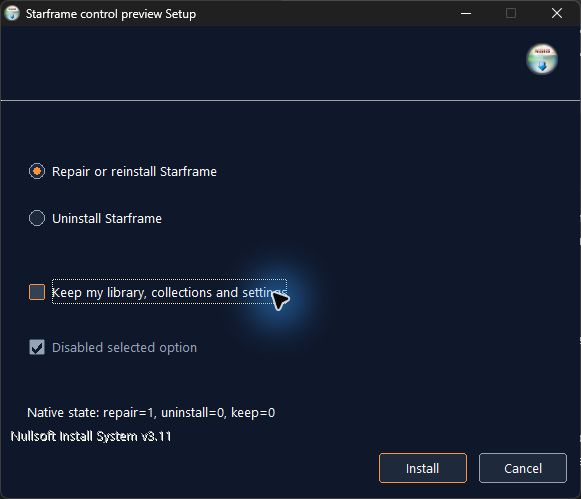
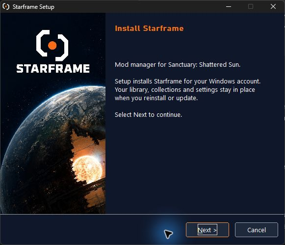
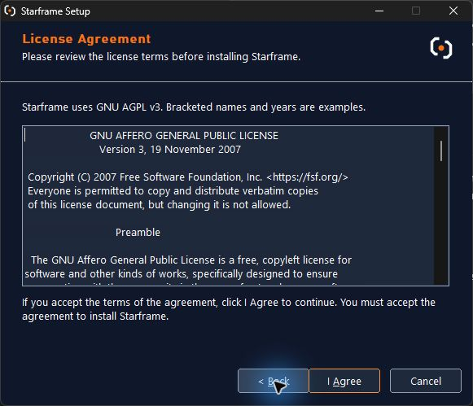
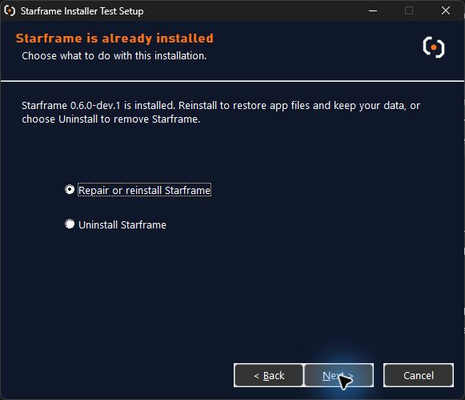
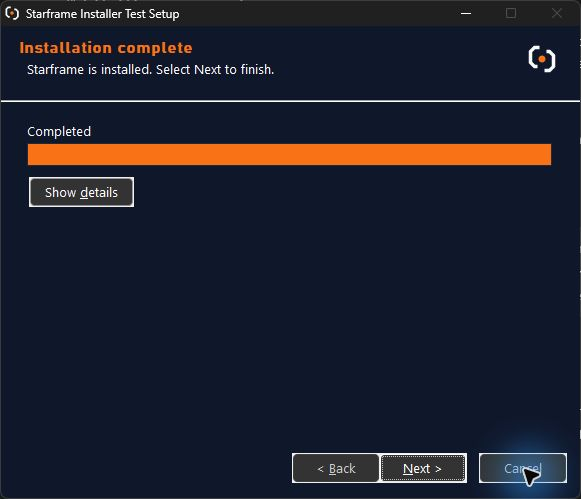
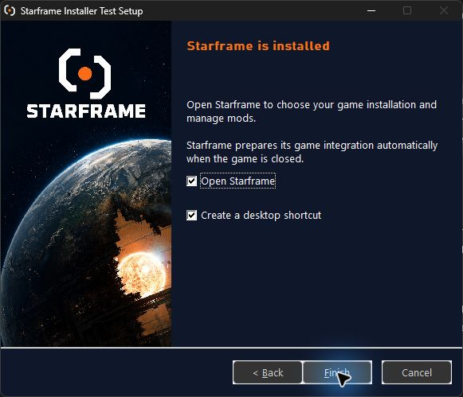

# Installer review

Issue [#74](https://github.com/Mastervoliumpl/Starframe/issues/74), 15 September 2026. These are native NSIS captures from **Starframe** and the separate **Starframe Installer Test** identity. They contain no personal paths.

The owner accepted the artwork, palette and general direction, then requested consistent styling for the remaining controls. After successful uninstall and keyboard review, the owner requested thin borders. A small native drawing helper now gives the existing buttons navy surfaces, thin borders and orange keyboard focus; field/group borders and dividers are also simplified. Windows controls retain their input behavior; high-contrast mode selects system colors and bypasses custom drawing. Windows common dialogs keep their platform appearance.

The welcome and license captures show the final thin borders. The maintenance, completed and finish captures record the earlier full-page review, before the shared drawing helper was added.

The latest welcome/license captures include the fixed-width focus outlines and aligned header. The header backdrop no longer paints over the title on a return visit. The approved checkmark shape is unchanged.

The owner accepted the installer and requested matching radio buttons and checkboxes on 16 September 2026. These now use thin borders, orange dots/checkmarks and a separate text focus indicator. The control-only fixture below exercises the production drawing helper; its empty header and NSIS footer are fixture scaffolding, not the packaged installer.

The [asset record](../ASSETS.md#windows-installer-artwork) identifies the portrait source and hashes. The [verification record](../../verification/windows-installer.md) separates observed behavior from remaining owner/display checks. These images are review evidence, not proof of screen-reader, scaling or high-contrast acceptance.
