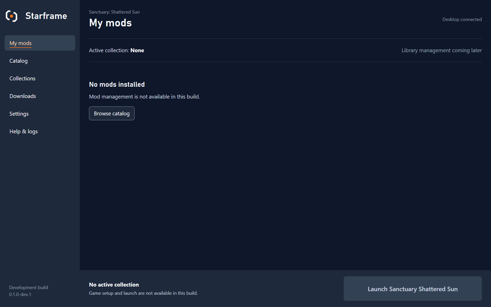
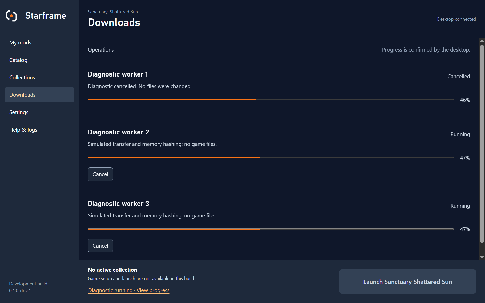

# Desktop state and navigation verification

Issue [#8](https://github.com/Mastervoliumpl/Starframe/issues/8), checked on 6 September 2026 at development version `0.1.0-dev.1`. This records local implementation evidence. It does not close the issue, approve a release, or complete milestone 0.1.0.

The app has six working navigation destinations and a native diagnostic workload. Unimplemented library, catalog, collection, game setup, update and launch features have explicit availability messages. The launch action retains its full label and solid fallback. No game files, loaders or mod downloads were used.

## Checks

| Check | Result |
| --- | --- |
| Frontend | Prettier, ESLint, Svelte/TypeScript checks and production build passed. Six Vitest tests passed. |
| Rust | Rustfmt, Clippy with warnings denied and eight Cargo tests passed. Generated TypeScript types match Rust serialization. |
| Repository | Twelve Python tests passed; product versions match. Local document links, fences and SVGs checked. |
| Browser interactions | Four Playwright tests passed: navigation/reconnect context preservation, failure/retry, keyboard/reflow, and 100 searches under simulated progress. |
| Native Windows release | Build and integration check passed against `src-tauri/target/release/starframe.exe`. |
| Native state | Initial subscription, live progress, cancellation confirmation and replacement subscription worked. Notes, row selection and scroll position survived reconnect. |
| Native boundaries | Invalid external-page arguments were rejected. A direct frontend call to the opener plugin was denied by capabilities. A second app process exited while the first remained open. Closing the native window during work ended its process. |
| Layout and input | Browser checks covered widths 1600, 1280, 1024 and 640, 200% text sizing, forced colors and reduced motion. Menu focus wraps within the dialog; Escape restores focus; navigation focuses the destination heading. Native screenshots were inspected at 1280 × 800 logical pixels and 150% display scale. |

The browser fixture transport exists only in development builds with `?fixture`. The native test uses the real Tauri channel and worker. CI now runs the browser suite and the native release check; this workflow change has not yet run on GitHub.

## Timing conditions

The native release check used Windows 11 Education, build 26200 (25H2), Evergreen WebView2 `152.0.4191.62`, an AMD Ryzen 7 7840HS (8 cores/16 threads), 32 GB installed RAM and a WD PC SN810 SSD. The machine has Radeon integrated graphics and an RTX 4070 Laptop GPU; the active rendering adapter was not established. WebView2 reported a device-pixel ratio of 1.5 and a 1280 × 800 logical viewport.

The list contained 1,000 fixture rows. All three simulated transfers remained active during measurement. One blocking worker hashed an 8 MiB memory buffer three times per iteration, then waited at least 100 ms before publishing progress. The transfers had no network payload or real transfer rate. Archive extraction was not exercised.

The test alternated filtered and unfiltered searches 100 times. It measured from dispatching the input event through two animation-frame callbacks, allowing a render opportunity between callbacks. This is an input-to-frame timing estimate, not a direct display measurement or a general frame-rate result.

| Environment | Search p95 | Largest sample | Samples above 100 ms |
| --- | --- | --- | --- |
| Native release, three active diagnostic lanes and memory hashing | 74.9 ms | 102.8 ms | 1 / 100 |
| Chromium browser fixture, simulated progress only | 85.1 ms | 91.7 ms | 0 / 100 |

Both runs met the 100 ms p95 target for this search workload. Raw timing samples and screenshots are written to `test-results/` by the checks. The browser and native workloads differ, so their values are not a performance comparison.

Measured contrast includes muted text on the sidebar (5.71:1), body text on selected surfaces (6.97:1), selected navigation text (7.65:1), and orange focus indicators against the selected surface (3.69:1). Orange is used for these non-text indicators; selected text uses the lighter orange shade.

## Native views

## Remaining verification

- Test the four-core/8 GB baseline, real bounded downloads and archive extraction when those operations exist. Measure navigation, selection and pending feedback separately; the current timing sample covers search.
- Check a screen reader in the native window, Windows display scale at 100% and 200%, and actual Windows text-size/high-contrast settings. Browser emulation does not establish these results.
- Confirm the existing window receives OS foreground focus on duplicate launch. The automated check establishes process ownership, not foreground activation.
- Review the implementation visually with the user. The earlier specimen approval is recorded separately in [design review](../design/REVIEW.md). Final launch artwork and installer/taskbar assets remain later work.
- Run the changed GitHub workflow after publication. Local checks do not establish hosted-runner behavior.

Storage (#9) and read-only game discovery (#10) were completed after this original check. The [milestone exit record](game-discovery.md) describes the integrated result. Mod management and game integration belong to later milestones.
